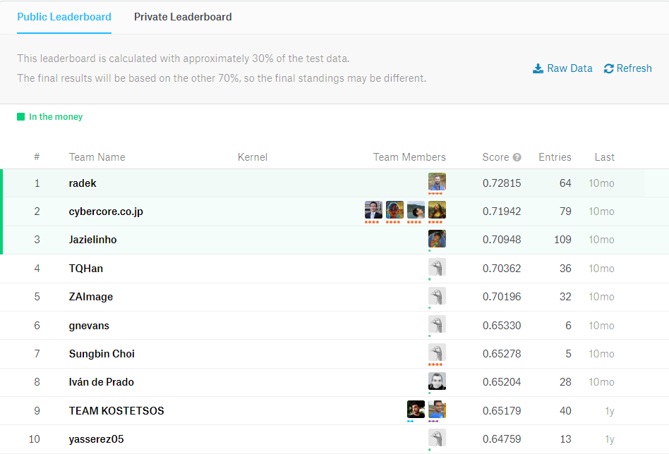
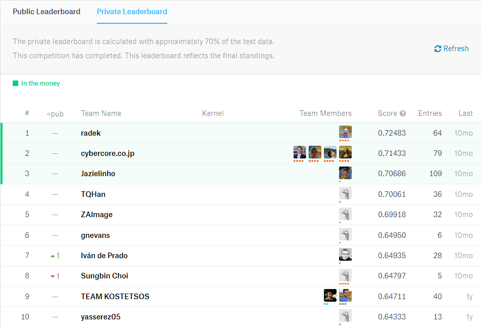

# Instructions

- Website: https://www.kaggle.com/c/imaterialist-challenge-fashion-2018/leaderboard

# A Breif Analysis for iMaterialist Challenge (Fashion) at FGVC5

In this competition, FGVC workshop organizers with Wish and Malong Technologies challenge you to develop algorithms that will help with an important step towards automatic product detection – to accurately assign attribute labels for fashion images. Individuals/Teams with top submissions will be invited to present their work live at the FGVC5 workshop.

## 经验分享
- 经验分享：https://blog.csdn.net/mmc2015/article/details/51301865?locationNum=12&fps=1
- 我的Kaggle初体验：https://www.wengbi.com/thread_95769_1.html

## Leaderboard (Evaluation: Mean F-score)

- Public Leaderboard

- Private Leaderboard

[public raw data](https://www.kaggle.com/c/8219/publicleaderboarddata.zip)
